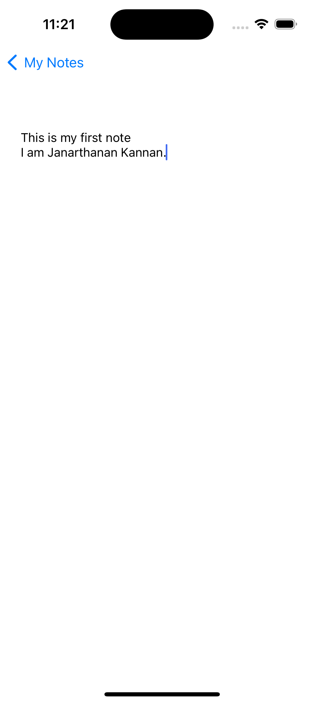
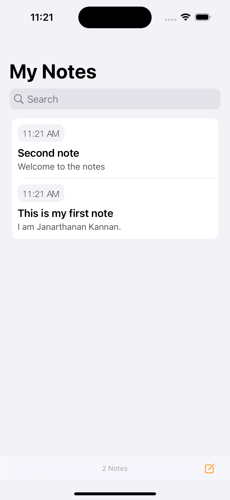

<h3>Notes App - UIKit</h3>

Notes App - UIKit is a simple notes app that uses Core Data framework for saving notes. CRUD operation handling with CoreData.
   
<h3>Tech Used</h3>

<ul>
  <li>Designed with MVC architecture</li>
  <li>Swift 5</li>
  <li>UIKit</li>
  <li>CoreData</li>
  <li>XCode 15</li>
</ul>
  

<h3>Screens</h3>

